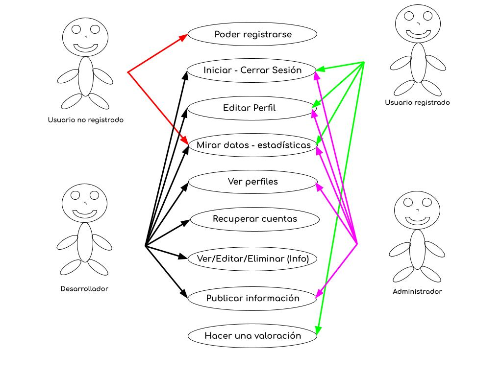
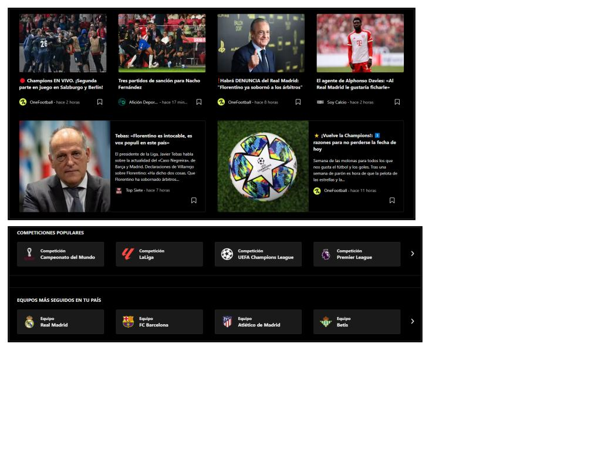
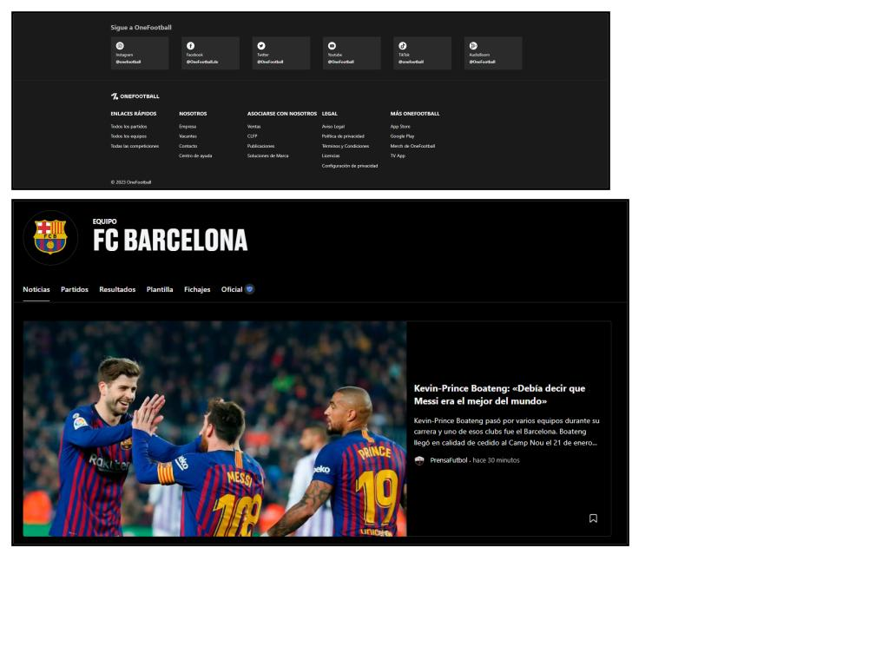
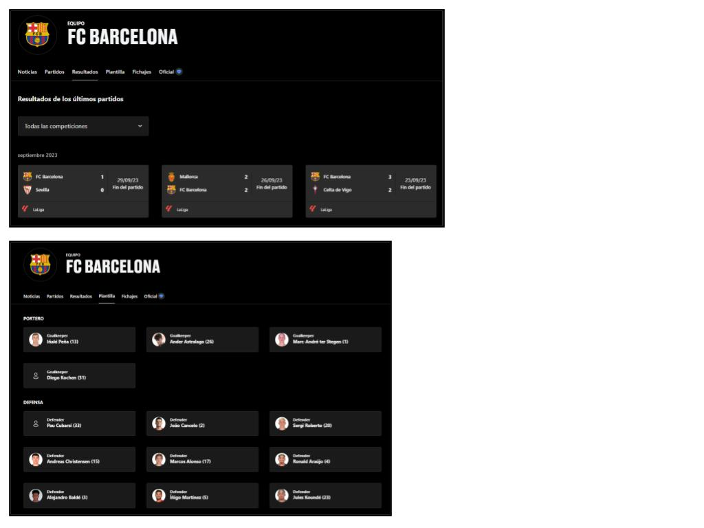

# Requesitos y diagrama de casos de uso

Usuario no registrado: Se puede registrar, mirar estadísticas y todo tipo de datos relacionados con el aspecto futbolístico de la página.

Usuario registrado: Puede iniciar sesión y ver su perfil, mirar estadísticas y datos, seguir a equipos y futbolistas que le interesen, escribir valoraciones sobre partidos, jugadores, etc…, y además escribir una valoración sobre nuestra página.

Admin: Ver perfiles de todos los registrados, puede recuperar cuentas, puede publicar todo tipo de contenido, editar y borrar datos, además de borrar cuentas perdidas o que influyan alguna de nuestras normativas.

Gestor: Puede hacer todo lo demás, excepto recuperar cuentas y borrarlas.

# PLANIFICACIÓN DEL PROYECTO

Lo principal es crear una plantilla con el lenguaje de programación html, css y java.

Una vez hecha la plantilla la clave es la organización a la hora de inyectar el contenido en nuestra web, mediante el diagrama de clases anterior tenemos los objetivos a realizar en la web, pero la clave de todo es el contenido.

Para empezar tendremos que implementar tanto los jugadores de fútbol como los equipos, después añadir toda la información sobre la historia, goles, asistencia, noticias, trofeos, etc…

Después añadiremos con java todo el código necesario para guardar tus jugadores, clubes, información favorita o interesante a seguir, además de un buscador para una mejor servicio de nuestra página y un formulario para que los usuarios registrados puedan ponernos su opinión, ya sea una crítica, un consejo o una opinión sobre la web y su información.

# Casos de uso específicos y diagramas de flujo

Casos de uso

Registrarse: Un usuario puede registrarse en la plataforma proporcionando su nombre, apellidos, email y contraseña.

Iniciar/Cerrar sesión: Un usuario registrado puede iniciar sesión en la plataforma proporcionando su email y contraseña, y puede cerrar su sesión en cualquier momento.

Editar Perfil: Un usuario registrado puede editar su perfil, actualizando su nombre, apellidos, email o contraseña.

Mirar datos y estadísticas: Un usuario puede acceder a la plataforma a ver los datos y estadísticas que quiera saber e informarse sobre las noticias de cada club.

Ver Perfiles: El Administrador y el Desarrollador pueden ver un listado de los perfiles que hay en la plataforma.

Recuperar cuentas: Un usuario puede recuperar su contraseña poniéndose en contacto con el desarrollador y este mismo le proporcionará la ayuda e información necesaria para poder recuperar su cuenta.

Ver/Editar/Eliminar(Info): Un Desarrollador puede ver, editar y eliminar la información como pueden ser los datos las estadísticas publicadas o valoraciones/comentarios que crea convenientes para mantener el buen funcionamiento de la plataforma.

Publicar Información: Un Administrador o un Desarrollador pueden publicar la información que crean conveniente como noticias sobre clubes o jugadores, estadísticas sobre los propios jugadores, etc…

Hacer una valoración: Un usuario puede hacer una valoración sobre alguna información o algún tipo de dato/estadística y generar un debate con los otros usuarios que quieran opinar sobre el tema.

# Documentación en repositorio

La aplicación presenta resultados, estadísticas, noticias, jugadores, clubes, trofeos, historias, clasificaciones y fichajes de los equipos y jugadores que mayoritariamente están jugando en las 5 ligas principales de Europa, además esta página estará para verla en  3 idiomas diferentes que son el castellano, catalan e inglés, además contará con un sistema de editores que podrán modificar y añadir toda aquella información sobre los jugadores y equipos de fútbol, pero antes tendrá que pasar por un control que hará el gestor para validar que el contenido esté completamente actualizado y funcional para que el lector esté bien informado de cualquier noticia.

¿Qué puedes ver en nuestra página? 

En nuestra pagina web podras ver resultados actualizados semanalmente de las 5 grandes ligas Europeas, también podrás ver las estadísticas actualizadas de cada partido, las noticias más recientes sobre clubes, ligas y jugadores, además de poder ver que trofeos tienen los clubes y jugadores y cuando los consiguieron, también se podrá ver una breve historia sobre los comienzos de cada club y su etapa más gloriosa y por último se actualizará semanalmente las bajas y altas (fichajes y ventas) de cada club. 

¿Quieres ponerte en contacto con nosotros?

Si alguien tiene alguna sugerencia para mejorar la página, tiene problemas sobre su cuenta o tiene problemas en la aplicación, lo más recomendable es ponerse en contacto con nosotros mediante un formulario que habrá en nuestra página web.
Correo de ayuda: ayuda@gmail.com

# Github Projects

# Hist3a - Diseño de la interfaz. Bocetos

# Hist4 - Wireframe, mockup y guía de estilos

